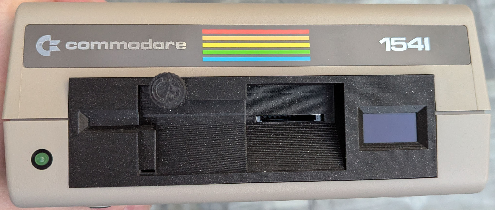
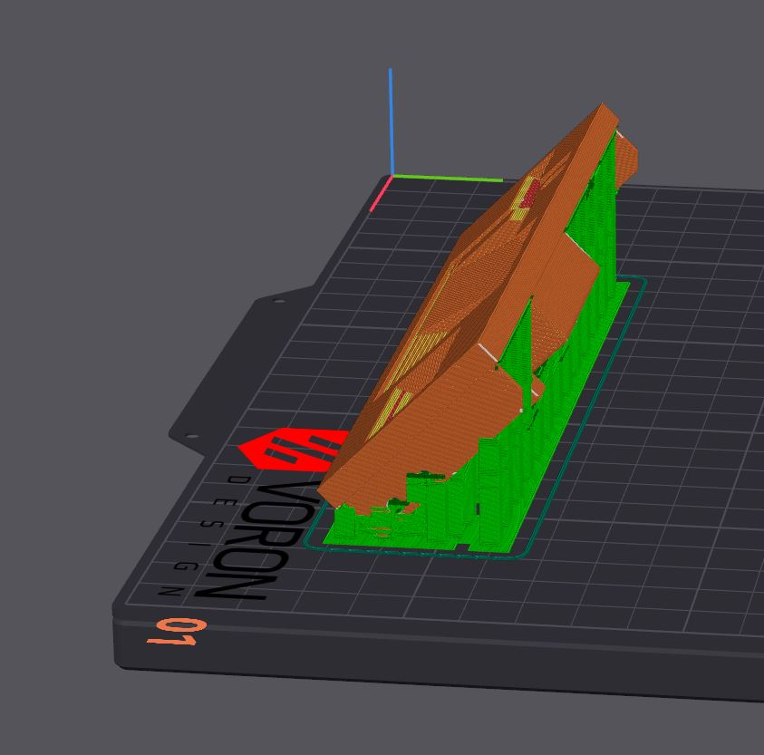

# 1541-Front Bezel

## CAD Files for printing

| Amount | Part |
| :---         |     :---:      |
| 1   | 1541_Bezel.stp     | 
| 1   | SD_Tray.stp     |
| 1   | Knob.stp     |
| 2   | 2xSide_Holder_LR.stp     |

### Print Settings

|Orientation (Bezel)| 45 deg |
| :---         |     :---:      |
|Layer Height | 0.15 |
|Wall loops | 5 |
|Top shell Layers |5|
|Bottom shell Layers |5|
|Infill density |20%|
|Infill pattern |Grid|

### Print Direction

## BOM

| Front Bezel | |
| :---         |     :---:      |
| Amount | Part |
| 2   | Heat Set Insert Nut M3 x D5.0 mm x L4.0 mm       |

| Display | |
| :---         |     :---:      |
| Amount | Part |
| 4   | Selftapping M2.6 x 6mm     | 

| SD-Card Tray | |
| :---         |     :---:      |
| Amount | Part |
| 2   | Selftapping M2 x 5 mm     | 
| 2   | BHCS M3 x 8 mm       | 

| Side Holder | |
| :---         |     :---:      |
| Amount | Part |
| 6   | BHCS M3 x 6 mm     | 
| 2   | M3 Washer       | 
| 6   | Heat Set Insert Nut M3 x D5.0 mm x L4.0 mm       | 